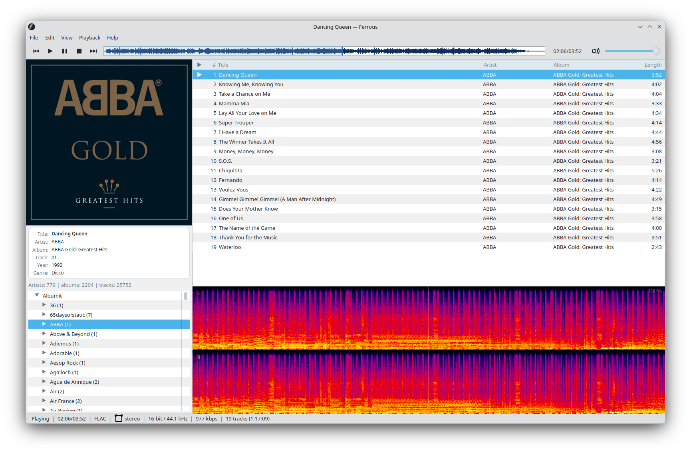

# Ferrous

A fast, KDE-native desktop music player built with Rust and Qt6.

Ferrous is a personal project built for my own daily listening. It pairs a Rust backend for playback, analysis, and library management with a Qt6/QML + KDE Kirigami frontend. Developed with KDE Plasma in mind, it targets responsive local-library workflows, gapless playback, and rich real-time visualization. Ferrous is opinionated about library organization — your folder structure *is* your library.



## Features

**Playback** — GStreamer-backed engine with seeking, gapless queue transitions, repeat, shuffle, and volume control.

**Library** — Folder-first browsing that mirrors your filesystem. Add one or more root directories, and Ferrous indexes them into a navigable tree with artist, album, and track grouping. [Global search](docs/SEARCH.md) spans the entire library, with ranked results and artist/album/track filters.

**Queue** — Open files, add folders, import M3U playlists, drag-to-reorder, and automatic session restore on launch.

**Tag editor** — Multi-file tag editing with bulk operations and auto-numbering.

**Album art** — Embedded cover art display with the option to fetch high-resolution artwork from the iTunes catalog.

**Visualization** — Live spectrogram and waveform displays rendered alongside embedded cover art. The spectrogram is inspired by Adobe Audition's spectral view — something I've spent countless hours using to analyze songs. It supports mono downmix or per-channel display, fullscreen viewing, logarithmic or linear frequency scale, adjustable dB range, configurable FFT window size, and centered or rolling display modes. Rolling mode scrolls continuously; centered mode shows a zoomable window around playback, with the view clamped at track boundaries. The waveform viewer supports zooming and per-channel inspection.

**Desktop integration** — MPRIS media controls, media key support, single-instance file opening, and `.desktop`/MIME registration.

**Scrobbling** — Last.fm integration with desktop authentication and batched submissions.

## Design priorities

Ferrous treats UI responsiveness as a correctness requirement. Playback, analysis, metadata extraction, library indexing, and search use background workers. Smooth visualization and immediately responsive interaction are development goals; if something feels sluggish, it's a bug.

## Supported Formats

MP3, FLAC, M4A/AAC, Ogg Vorbis, Opus, WAV, AC-3, DTS, and M3U/M3U8 playlists. Actual codec support depends on the GStreamer plugins installed on the host system.

## Installation

Prebuilt RPM (Fedora) and deb (Ubuntu/Debian) packages are available from [GitHub Releases](https://github.com/Tiaxi/ferrous/releases).

To build from source, install the prerequisites in the [installation guide](docs/INSTALL.md), then:

```bash
git clone https://github.com/Tiaxi/ferrous.git
cd ferrous
./scripts/run-ui.sh
```

See the [installation guide](docs/INSTALL.md) for full dependency lists, manual build steps, and local package builds.

## Status

Ferrous is a personal project tailored for my specific needs and workflow. It is usable for daily listening but still under active development. Contributions and feedback are welcome, though the project direction follows my own priorities.

See the [backlog](docs/ROADMAP.md) for open ideas.

## Tech Stack

| Layer | Technology |
|-------|------------|
| Backend | Rust (playback, metadata, library, search, analysis) |
| Frontend | Qt6/QML + KDE Kirigami |
| Audio | GStreamer |
| Storage | SQLite |

## Documentation

- [Installation guide](docs/INSTALL.md) — dependencies, build options, data locations
- [Development guide](docs/DEVELOPMENT.md) — building, testing, debugging, profiling
- [Backlog](docs/ROADMAP.md) — open feature and maintenance ideas
- [Contributing](CONTRIBUTING.md) — proposing and submitting changes

## License

This project is licensed under the [GNU General Public License v3.0](LICENSE).
