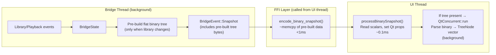

# Full Binary Bridge — Implementation Plan

## Goal

Completely remove JSON from the Rust↔Qt bridge and replace with a zero-overhead binary protocol. Eliminate all heavy computation from the UI thread.

## Background

The current bridge uses JSON for all communication between the Rust backend and the Qt/QML UI. In in-process mode (the default), `ferrous_ffi_bridge_poll()` is called from a 16ms timer on the UI thread. This call path builds the full library tree JSON (`build_library_tree_json()` iterating 30k tracks), serializes it, and the Qt side then parses it back with `QJsonDocument::fromJson()`, converts to `QVariantList`, and finally parses into `TreeNode` structs. This causes 50-120ms UI freezes on startup, sort changes, and scan completion.

The out-of-process bridge (`FERROUS_BRIDGE_MODE=process` / `frontend_cli --json-bridge`) is a legacy debug path not used in production. It is removed as part of this plan.

---

## Architecture Analysis: What Still Blocks the UI Thread?

Binary encoding alone **is not sufficient**. Here's what still runs on the UI thread even after switching to binary:

### The Problem: `poll()` runs on the UI thread

```
UI Thread Timer (16ms)
  → ferrous_ffi_bridge_poll()          // FFI call
    → FfiRuntime::poll()               // Rust code ON UI THREAD
      → bridge.try_recv()              // drain events (fast)
      → encode_binary_snapshot()       // STILL ON UI THREAD
        → build_library_tree_flat()    // iterates 30k tracks, sorts, groups
                                       // O(n log n) — THIS IS THE BOTTLENECK
```

Binary encoding makes serialization fast (~1ms vs ~15ms for JSON), but **tree building** — iterating all tracks, grouping by artist/album, sorting, resolving metadata — is O(n log n) and takes **10-30ms for 30k tracks** regardless of output format.

### The Solution: Pre-build tree on the bridge thread

The `ferrous-bridge` thread already runs in the background and has full access to `LibrarySnapshot`. We pre-build the flat binary tree there — where it's free — and include the pre-built bytes in `BridgeSnapshot`. The FFI layer just memcpys pre-built bytes.

### Optimal Architecture



**UI thread total cost per frame: ~0.2ms** (down from 50-120ms with JSON).

### Remaining Minor UI Thread Costs (not blocking)

These survive the binary switch but are individually <5ms (well under one frame):

- `LibraryTreeModel::rebuildRows()` — flattens parsed TreeNode tree to visible rows (~1-5ms)
- `findTrackCoverUrl()` — filesystem stat for cover art on track change
- `beginResetModel()`/`endResetModel()` — standard Qt model reset signal

---

## What Gets Removed

| Component | Lines removed |
|-----------|--------------|
| JSON snapshot encoding (`ffi.rs`) | ~250 lines |
| JSON command parsing (`ffi.rs`) | ~300 lines |
| JSON tree builder (`library_tree.rs`) | ~220 lines |
| Out-of-process bridge (`frontend_cli.rs`) | ~600 lines |
| JSON processing (`BridgeClient.cpp`) | ~500 lines |
| Legacy tree parsers (`LibraryTreeModel.cpp`) | ~100 lines |
| **Total** | **~1970 lines** |

---

## Binary Snapshot Format (Rust → Qt)

All multi-byte values are **little-endian**. All strings are **UTF-8**.

```
Header (12 bytes):
  [u32 magic=0xFE550001] [u32 total_length] [u16 section_mask] [u16 reserved]

Sections (each prefixed with [u32 section_length], only present if bit set in mask):

  Bit 0: Playback
    [u8 state] [f64 position_secs] [f64 duration_secs] [f32 volume]
    [u8 repeat_mode] [u8 shuffle_enabled] [i32 current_queue_index]
    [u16 current_path_len] [current_path_bytes...]

  Bit 1: Queue
    [u32 queue_len] [i32 selected_index] [f64 total_duration_secs]
    [u32 unknown_duration_count] [u32 track_count]
    Per track:
      [u16 title_len] [title_bytes...]
      [u16 artist_len] [artist_bytes...]
      [u16 album_len] [album_bytes...]
      [u16 genre_len] [genre_bytes...]
      [i32 year] (i32::MIN when unknown)
      [u16 track_number] (0 when unknown)
      [f32 length_secs] (-1 when unknown)
      [u16 path_len] [path_bytes...]

  Bit 2: Library Meta
    [u32 root_count] [u32 track_count] [u8 scan_in_progress] [i32 sort_mode]
    [u16 error_len] [error_bytes...] [u32 roots_completed] [u32 roots_total]
    [u32 files_discovered] [u32 files_processed] [f32 files_per_second]
    [f32 eta_seconds] [u16 root_path_count]
    Per root: [u16 path_len] [path_bytes...]

  Bit 3: Library Tree (flat rows, pre-built on bridge thread)
    [u32 row_count]
    Per row:
      [u8 row_type]           (0=root, 1=artist, 2=album, 3=section, 4=track)
      [u16 depth]
      [i32 source_index]      (-1 if N/A)
      [u16 track_number]
      [u16 child_count]       (aggregate count for display)
      [u16 title_len]         [title_bytes...]
      [u16 key_len]           [key_bytes...]
      [u16 artist_len]        [artist_bytes...]
      [u16 path_len]          [path_bytes...]
      [u16 cover_path_len]    [cover_path_bytes...]
      [u16 track_path_len]    [track_path_bytes...]
      [u16 play_path_count]
      Per play path: [u16 path_len] [path_bytes...]

  Bit 4: Metadata
    [u16 source_path_len] [source_path_bytes...]
    [u16 title_len] [title_bytes...]
    [u16 artist_len] [artist_bytes...]
    [u16 album_len] [album_bytes...]
    [u16 genre_len] [genre_bytes...]
    [i32 year] (i32::MIN when unknown)
    [u32 sample_rate_hz] [u32 bitrate_kbps] [u16 channels] [u16 bit_depth]
    [u16 cover_path_len] [cover_path_bytes...]

  Bit 5: Settings
    [f32 volume] [u32 fft_size] [f32 db_range]
    [u8 log_scale] [u8 show_fps] [i32 library_sort_mode]

  Bit 6: Error
    [u16 message_len] [message_bytes...]

  Bit 7: Stopped
    (no payload, presence of bit signals the event)
```

## Binary Command Format (Qt → Rust)

```
[u16 cmd_id] [u16 payload_len] [payload_bytes...]
```

| ID | Command | Payload |
|----|---------|---------|
| 1 | play | (none) |
| 2 | pause | (none) |
| 3 | stop | (none) |
| 4 | next | (none) |
| 5 | previous | (none) |
| 6 | set_volume | `[f64 value]` |
| 7 | seek | `[f64 value]` |
| 8 | play_at | `[u32 index]` |
| 9 | select_queue | `[i32 index]` (-1 = none) |
| 10 | remove_at | `[u32 index]` |
| 11 | move_queue | `[u32 from] [u32 to]` |
| 12 | clear_queue | (none) |
| 13 | add_track | `[u16 len] [path...]` |
| 14 | play_track | `[u16 len] [path...]` |
| 15 | replace_album | `[u16 count] ([u16 len] [path...])*` |
| 16 | append_album | `[u16 count] ([u16 len] [path...])*` |
| 17 | replace_album_by_key | `[u16 artist_len] [artist...] [u16 album_len] [album...]` |
| 18 | append_album_by_key | `[u16 artist_len] [artist...] [u16 album_len] [album...]` |
| 19 | replace_artist_by_key | `[u16 len] [artist...]` |
| 20 | append_artist_by_key | `[u16 len] [artist...]` |
| 21 | add_root | `[u16 len] [path...]` |
| 22 | remove_root | `[u16 len] [path...]` |
| 23 | rescan_root | `[u16 len] [path...]` |
| 24 | rescan_all | (none) |
| 25 | set_repeat_mode | `[u8 mode]` (0=Off, 1=One, 2=All) |
| 26 | set_shuffle | `[u8 enabled]` |
| 27 | set_db_range | `[f32 value]` |
| 28 | set_log_scale | `[u8 value]` |
| 29 | set_show_fps | `[u8 value]` |
| 30 | set_library_sort_mode | `[i32 mode]` |
| 31 | set_fft_size | `[u32 size]` |
| 32 | request_snapshot | (none) |
| 33 | shutdown | (none) |

---

## File Changes

### Rust

#### [MODIFY] `src/frontend_bridge/mod.rs`
- Add `pre_built_tree_bytes: Option<Vec<u8>>` to `BridgeSnapshot`
- In `run_bridge_loop()`: when library changes, call `build_library_tree_flat_binary()` on the bridge thread and cache the result in `BridgeState`
- Include cached tree bytes in `BridgeState::snapshot()`

#### [MODIFY] `src/frontend_bridge/ffi.rs`
- Replace all JSON encoding/decoding with binary
- `encode_binary_snapshot()`: writes header + sections, uses pre-built tree bytes from snapshot (memcpy)
- `parse_binary_command()`: reads binary command format
- New FFI exports: `ferrous_ffi_bridge_send_binary`, `ferrous_ffi_bridge_pop_binary_event`, `ferrous_ffi_bridge_free_binary_event`
- Remove JSON FFI exports and all `serde_json` usage

#### [MODIFY] `src/frontend_bridge/library_tree.rs`
- Replace `build_library_tree_json()` → `build_library_tree_flat_binary()` returning `Vec<u8>`
- Same tree-building logic (artist grouping, album resolving, sorting), binary output format

#### [MODIFY] `src/bin/frontend_cli.rs`
- Remove `run_json_bridge()` and all JSON helpers (~600 lines)
- Remove `--json-bridge` flag handling
- Keep `run_interactive_cli()` (uses `FrontendBridgeHandle` directly, no JSON)

#### [MODIFY] `Cargo.toml`
- Remove `serde_json` dependency if no other code uses it

### Qt

#### [NEW] `ui/src/BinaryBridgeCodec.h` / `ui/src/BinaryBridgeCodec.cpp`
- Command encoding helpers
- Snapshot decoding into a `DecodedSnapshot` struct
- Endian-aware read/write utilities

#### [MODIFY] `ui/src/BridgeClient.h` / `ui/src/BridgeClient.cpp`
- Remove: `processBridgeJsonObject()`, `handleStdoutReady()`, `startBridgeProcess()`, `sendJson()`, QProcess setup, all JSON includes
- Add: `sendBinaryCommand()`, `processBinarySnapshot()`
- `pollInProcessBridge()` → pop binary events instead of JSON
- All command-sending methods → encode with binary codec

#### [MODIFY] `ui/src/LibraryTreeModel.h` / `ui/src/LibraryTreeModel.cpp`
- Add `setLibraryTreeFromBinary(const QByteArray &data)` → direct binary-to-TreeNode parsing
- Remove JSON-based `parseNodes()`, `parseLegacyArtistTree()`

#### [MODIFY] `ui/src/FerrousBridgeFfi.h`
- Replace JSON FFI declarations with binary FFI declarations

#### [MODIFY] `ui/CMakeLists.txt`
- Add `BinaryBridgeCodec.cpp` / `.h` to sources

### Docs & Scripts

- Update `docs/FRONTEND_CLI.md` — remove `--json-bridge` references
- Update `docs/MIGRATION_NOTES.md` — remove `FERROUS_BRIDGE_MODE=process` references
- Update `ui/README.md` — remove process bridge documentation
- Update `scripts/run-ui.sh` — remove process bridge fallback logic

---

## Verification Plan

### Automated Tests

1. `cargo test` — all existing Rust tests pass (adapt tests that used JSON encoding)
2. New: `encode_binary_snapshot()` ↔ decode round-trip tests
3. New: `parse_binary_command()` tests for each command ID
4. New: `build_library_tree_flat_binary()` correctness tests
5. Qt `ui/tests/` — adapt LibraryTreeModel tests to use binary input

### Manual Verification

1. Launch with 30k+ track library — UI must stay responsive during startup
2. Add/remove library roots, rescan — no freeze
3. Change sort mode — instant response
4. All playback controls, queue operations, volume, seek — work correctly
5. Verify `frontend_cli` interactive CLI still works
