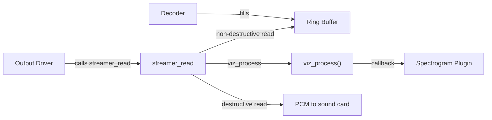
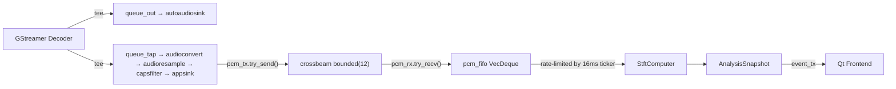

# How DeaDBeeF Achieves Zero-Latency Spectrogram Sync

## The Key Insight

DeaDBeeF's spectrogram appears perfectly synced because **visualization data is generated synchronously inside the same function call that hands PCM bytes to the sound card**. There is no separate pipeline, no queuing, no cross-thread handoff — the spectrogram reads the *exact same bytes* at the *exact same moment* they leave for playback.

## DeaDBeeF Architecture (Pull-Based)



### The Critical Path ([streamer.c:2487–2522](file:///home/tuomas/Downloads/deadbeef-1.10.0/src/streamer.c#L2487-L2522))

```c
int streamer_read (char *bytes, int size) {
    // 1. Fill decoded blocks into ring buffer
    _streamer_fill_playback_buffer();

    // 2. Read viz data from ring buffer WITHOUT consuming it
    ringbuf_read_keep_offset(&_output_ringbuf, _viz_read_buffer.buffer, viz_bytes, -offset);

    // 3. Feed to visualizer synchronously
    viz_process(_viz_read_buffer.buffer, viz_bytes, output, 4096, wave_size);

    // 4. Then consume the same bytes for actual playback
    return _streamer_get_bytes(bytes, size);
}
```

[streamer_read()](file:///home/tuomas/Downloads/deadbeef-1.10.0/src/streamer.c#2487-2524) is the function the audio output plugin (ALSA / PulseAudio) calls to **pull** PCM data. Steps 2–4 happen atomically within a single call:

1. **Non-destructive read** via [ringbuf_read_keep_offset()](file:///home/tuomas/Downloads/deadbeef-1.10.0/src/ringbuf.c#120-124) — copies bytes from the ring buffer without advancing the read pointer
2. **[viz_process()](file:///home/tuomas/Downloads/deadbeef-1.10.0/src/viz.c#156-246)** — converts to float, invokes all waveform listener callbacks (including the spectrogram plugin's [spectrogram_wavedata_listener](file:///home/tuomas/Downloads/ddb_spectrogram/spectrogram.c#605-630))
3. **[_streamer_get_bytes()](file:///home/tuomas/Downloads/deadbeef-1.10.0/src/streamer.c#2310-2375)** — destructive read from the same ring buffer → bytes go to the sound card

The spectrogram plugin accumulates these samples into its FFT input buffer and runs FFT on the GTK draw timer (~25 ms). Since the data was captured at the exact moment of playback output, the only delay is:

- **FFT window center** (~93 ms for FFT 8192 @ 44.1 kHz) — inherent to spectral analysis
- **Draw timer** (25 ms refresh interval)

> [!IMPORTANT]
> There is **no inter-thread queuing latency**. The waveform callbacks in [viz_process()](file:///home/tuomas/Downloads/deadbeef-1.10.0/src/viz.c#156-246) are dispatched asynchronously via `dispatch_async(process_queue, ...)` ([viz.c:234](file:///home/tuomas/Downloads/deadbeef-1.10.0/src/viz.c#L234)), but this happens on a dedicated serial dispatch queue — it's not accumulating in a FIFO or getting rate-limited by a ticker.

---

## Ferrous Architecture (Push-Based)



### Latency Sources

| Stage | Mechanism | Estimated Delay |
|---|---|---|
| **GStreamer tee + queue_tap** | Separate branch with leaky queue (128 buffers) | ~5–20 ms |
| **audioconvert + audioresample** | Signal processing pipeline | ~2–5 ms |
| **appsink sync=true** | Clock-aligned delivery — waits until "presentation time" | ~0 ms added (but it doesn't know about downstream latency) |
| **crossbeam channel bounded(12)** | `try_send()` fails → drops samples if analysis can't keep up | ~0–10 ms |
| **pcm_fifo accumulation** | FIFO with ~0.5s cap, consumed on 16ms ticker | **~10–40 ms** |
| **Ticker rate-limiting** | 16ms tick cadence with backlog control | **~16 ms** |
| **STFT pending buffer** | Needs [fft_size](file:///home/tuomas/gdrive/Code/ferrous/src/analysis/mod.rs#768-771) samples before yielding a row | ~20 ms |
| **FFT window center** | Inherent: `fft_size / 2 / sample_rate` | ~93 ms (FFT 8192) |
| **Snapshot emit throttle** | 16ms minimum between emissions | ~16 ms |
| **Frontend rendering** | Qt column queue painting | ~16 ms |
| **Total** | | **~90–200 ms** |

### The Fundamental Problem

The appsink with `sync=true` delivers PCM buffers aligned to the GStreamer clock — this means they arrive roughly at the time the audio *would be* output. But then multiple buffering stages add delay:

1. The **crossbeam channel** adds queuing latency (up to 12 buffer slots)
2. The **pcm_fifo** in the analysis thread adds more buffering
3. The **16ms ticker** adds discretization delay — samples sit in the FIFO until the next tick
4. The **backlog controller** steers toward `effective_delay_samples` depth, which at `BASE_VISUAL_DELAY_MS=0` should be zero, but in practice the FIFO holds some backlog due to the bursty nature of GStreamer buffer delivery vs. 16ms-tick consumption

---

## What DeaDBeeF Does Differently

| Aspect | DeaDBeeF | Ferrous |
|---|---|---|
| **Architecture** | Pull-based: viz in output callback | Push-based: separate pipeline branch |
| **Threading** | Viz data generated on output thread | Viz data generated on analysis thread |
| **Buffering stages** | 1 (ring buffer, non-destructive read) | 5+ (tee, queue, appsink, channel, fifo) |
| **Rate control** | Natural: one viz call per output pull | Artificial: 16ms ticker with backlog control |
| **Timing reference** | Sound card pull rate (≈ real-time) | GStreamer clock + multiple async hops |
| **FFT size** | Fixed 8192 | Configurable (512–8192) |
| **Data flow** | Same data, same moment | Tee'd copy, delayed delivery |

## Possible Approaches for Ferrous

### Option A: Eliminate the Intermediate Buffering

Remove the `pcm_fifo` and the 16ms ticker. Instead, feed STFT directly in the appsink callback (or immediately upon `pcm_rx` arrival) and emit rows synchronously. This cuts 3+ latency stages.

**Pros**: Simplest change, keeps GStreamer architecture  
**Cons**: STFT computation on the GStreamer streaming thread (or at least immediately in the analysis thread) may cause jitter if the FFT is slow; still has the fundamental tee/queue delay

### Option B: Use a GStreamer Raw Pipeline Instead of playbin

Replace `playbin` with a manual pipeline where you control the exact audio sink. Insert a custom element or use [identity](file:///home/tuomas/gdrive/Code/ferrous/src/playback/mod.rs#307-329) with a handoff signal on the *output branch* just before the final audio sink. This would give you PCM data at the exact same point as playback output.

**Pros**: Same timing semantics as DeaDBeeF  
**Cons**: Significant refactoring; you lose `playbin`'s auto-detection of decoders and sinks

### Option C: Negative Offset Compensation

Query the audio sink's latency via `gst::Query::new_latency()` on the output branch, then advance the analysis branch data by that amount. This doesn't change the architecture but counteracts the known delay.

**Pros**: Minimal code change  
**Cons**: Imprecise; sink latency may not account for all buffering stages

### Option D: Stop Ticker-Based Consumption

The simplest high-impact change: instead of consuming PCM from the FIFO on a 16ms ticker, process it **immediately** when it arrives from the channel. Use a dedicated thread that blocks on `pcm_rx.recv()` and feeds the STFT inline. This eliminates the ticker discretization delay and the FIFO accumulation delay.

```
pcm_rx.recv() → STFT.enqueue_samples() → STFT.take_rows() → emit immediately
```

**Pros**: Removes most non-inherent latency (~30-60 ms); relatively contained change  
**Cons**: Still has GStreamer tee/queue latency (~5-20 ms)
